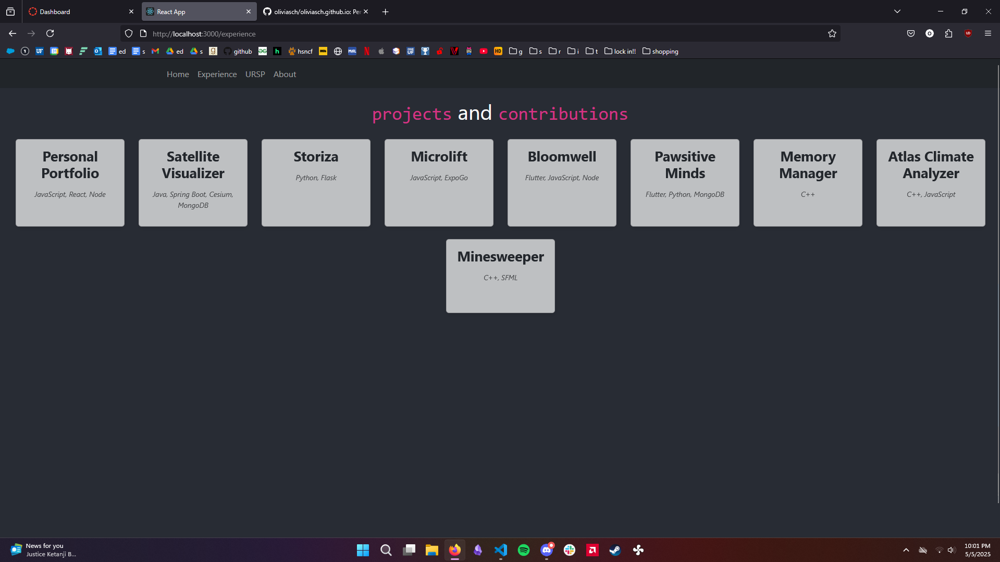
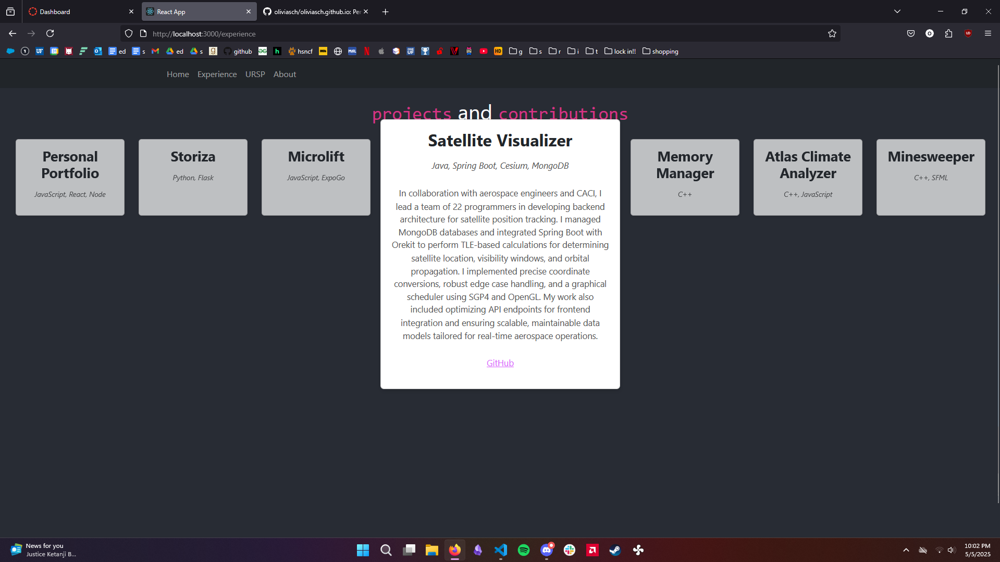
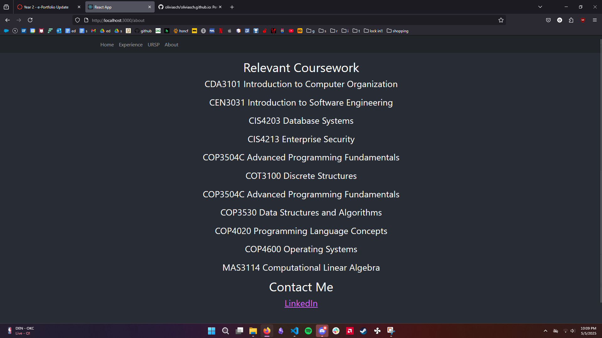

# oliviasch.github.io
Hi! I'm currently working on coding my personal portfolio. All of the code can be found at https://github.com/oliviasch/oliviasch.github.io, which includes all of the pages I used for the required URSP Year 2 submission. Unfortunately, I'm still working on deploying the website properly. The code is there, but I can't figure out how to make GitHub launch that instead of this README.md file. I'm also pretty unsatisfied with all the designs right now; they're quite unoriginal and based off of a template. 

In the meantime, as this gets fixed, please enjoy some screenshots of my current progress. 

## Experience Page

## URSP Journal Entry Page

### Year 1
My first year at the University of Florida has genuinely been one of the best experiences of my life. From navigating the nuances of university-level coursework to unwinding with friends, the year has been filled with a whirlwind of adventures and growth. An academic transition adapting to the rhythm of studying and campus lifestyle was quintessential in thriving. I had to hold myself accountable for a smaller quantity of albeit incredibly more important assignments and exams. I found immense satisfaction in pursuing a subject that has fascinated me since my elementary school years. Jumping into the beginnings of my Computer Science degree has only continued to invigorate my passion for technology. While I'm sure that I am bound to encounter more significant trials and tribulations as I continue my studies, this strong foundation in my first year has provided me the confidence to take them in stride.

### Year 2
This year, one of my most beloved projects has been working on Storiza, a project aimed at helping young children learn to read through interactive storytelling. My focus has been on integrating cutting-edge Automatic Speech Recognition (ASR) models like Whisper and Wav2Vec to provide real-time feedback on reading fluency. It's been a meaningful experience that blends my interest in generative artificial intelligence with my desire to build technology that makes a real-world impact in education, especially to Title 1 schools. Our team has also implemented real-time speech analysis using LLMs for adaptive learning, analyzed over 1,500 human-scored audio samples to guide story selection, and prepared the system for deployment on UF’s HiPerGator supercomputer. The project has already reached over 50 children in Gainesville and was accepted for presentation at UF’s AI Conference. I continue to feel great passion for Computer Science as I dive deeper and deeper into my degree.

## About Page
